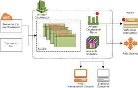
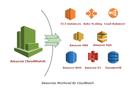

# Monitoring & Aleret management

### Why do we need to Monitor?

Cloud monitoring is the practice of measuring, evaluating, monitoring, and managing workloads inside cloud tenancies against specific metrics and thresholds. It can use either manual or automated tools to verify the cloud is fully available and operating properly.

Cloud monitoring allows you to find out if your cloud-hosted applications are performing within their Service-Level Agreement (SLA), discover any potential security risks, identify any capacity issues, and analyze costs.

### 4 Golden "Signals" of Monitoring

- Latency: The time it takes to service a request.
 

- Traffic: A measure of how much demand is being placed on your system, measured in a high-level system-specific metric. For a web service, this measurement is usually HTTP requests per second.
 

- Errors: The rate of requests that fail, either explicitly (e.g., HTTP 500s), implicitly (for example, an HTTP 200 success response, but coupled with the wrong content), or by policy (for example, "If you committed to one-second response times, any request over one second is an error"). 
 

- Saturation: How "full" your service is. A measure of your system fraction, emphasizing the resources that are most constrained (e.g., in a memory-constrained system, show memory; in an I/O-constrained system, show I/O).

### What is Alert Management?

The alert management process consists of monitoring systems, defining what’s normal, and notifying the right people when something abnormal occurs so that the right teams can be made aware of the issue and resolve it.

##### Simple notification service (SNS)

Simple Notification Service (SNS) is a cloud service for coordinating the delivery of push messages from software applications to subscribing endpoints and clients.

##### Simple Queue Service (SQS)

Amazon Simple Queue Service (SQS) is a managed message queuing service technical professionals and developers use to send, store and retrieve multiple messages of various sizes asynchronously.

#### Cloud watch to monitor AWS service/s

Amazon CloudWatch is an AWS monitoring and management service which is designed for the purpose of maintaining the services and resources which are used. Particularly, this is designed for developers, site reliability engineers, IT managers, and system operators to make their life easier.

### Set UP

- Navigate to EC2 

- Go to Status Check and Monitoring (No Logs here)

- To start monitoring `Manage detailed monitoring`

- click `Enable` (Comes with a charge), then `Confirm`

- Now need to create a dashboard.

### Set up an SNS 

Set up SNS alert, i.e. CPU utilization 

1. Navigate to <b>Cloudwatch</b> service.
2. Choose <b>Alarms</b> and then choose <b>Create Alarm</b>.
3. Within <b>Metrics</b>, paste your InstanceID in the search bare and tick the metric you want to set an alarm for (In this case CPU Utilization). Then `Select Metric`.
4. Within the next section choose the <b>Period</b> the threshold needs to be passed for. Choose the <b>Type</b> of threshold and then choose the value you want your threshold to be. `Next`

5. Next section select <b>Alarm state trigger</b> to be <b>In Alarm</b>. <b>Create new topic</b> will prompt you to give the topic a name and enter the email of the endpoints that will recieve the notification (You will hav to subscribe to SNS), <b>Add notification</b>, click `Next`.

6. Next Give the Alarm a name and specifiy the contents of the email, `Next`

7. Preview and `Create Alarm`.

### Test the SNS Alarm

1. Create a endless whileloop within a python file, within your EC2 instance and run it. this should spike CPU Utilization.

2. Your alarm state will be <b>In Alarm</b> and you should recieve an E-mail. 

